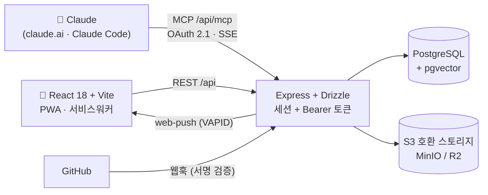

<div align="center">


# DevFlow

**팀의 하루를 정리하는 프로젝트 워크스페이스**
프로젝트별 팀원 배정 → 매일 할 일 지정·체크 → 가이드(조언) 수행 추적 → 끝나면 **재사용 가능한 노하우(SKILL.md)** 추출

[](https://devfloww.replit.app)


[체험하기](#-30초-체험) · [주요 기능](#-무엇을-할-수-있나요) · [Claude 연동](#-claude-연동-mcp) · [설치](#-빠른-시작) · [아키텍처](#-아키텍처)

</div>

---

## ⚡ 30초 체험

1. **https://devfloww.replit.app** 접속 → 로그인/가입 (프로젝트 참여는 초대 링크로만)
2. 캘린더(기본 화면)에서 **행=요일 × 열=팀원** 워크로드를 한눈에 — 카드를 **드래그해서 다른 요일·담당자로 이동**
3. 폰에서는 홈 화면에 설치하세요 — 앱 아이콘 **배지에 오늘 내 할 일 수**가 떠요
   (Android: Chrome ⋮ → 앱 설치 / iPhone: Safari 공유 → 홈 화면에 추가, iOS 16.4+)

## 💡 무엇을 할 수 있나요?

- 📋 **매일 할 일 관리** — 태스크(복수 담당·체크리스트·서브태스크 롤업) + 리스트/칸반/캘린더/타임라인(Gantt-lite) 4개 뷰
- 🗓 **팀 워크로드 캘린더** — 주간 팀원별 그리드, 카드 드래그로 예정일·담당자 변경, 할 일/일정 필터, 일정(30분 전 리마인더)
- 📄 **문서 → 실행 계획** — 마크다운 문서 트리에 설계서를 쓰면 **태스크+체크리스트로 자동 분해**(검토 후 일괄 반영, 출처 역추적·진행률 표시)
- 🎫 **티켓 워크플로우** — 멤버가 작업을 제안(요청) → 매니저 승인(담당자 배정)/반려(사유 필수)
- 💬 **가이드 추적** — 할 일에 조언/가이드 댓글(+파일)을 달면 **팀원별 수행 여부**를 추적
- 🧠 **노하우 추출** — 프로젝트 완료 시 적용된 가이드·해결한 블로커를 모아 **SKILL.md 초안** 생성 → 검수 후 게시, AI RAG 검색/Q&A
- 🤖 **Claude 연동(MCP)** — claude.ai 커스텀 커넥터 또는 Claude Code에서 문서 등록→분해→배정→보고까지 대화로 수행
- 📱 **설치형 PWA** — 홈 화면 설치, 앱 아이콘 배지 = 오늘 내 할 일 수, 웹 푸시 알림(티켓·가이드·일정 리마인더)
- 🔗 **GitHub 연동** — 웹훅 서명 검증, 커밋/PR의 `PRJ-12` 키 파싱, PR 머지 시 자동 완료(가드레일)
- 📝 **회의록 v2** — 회의 텍스트 업로드 → 결정/실행항목/가이드 추출 제안 → 사람이 승인해야 반영

### 🆕 최근 업데이트

- **MCP 일정 도구** — `create_event`/`list_events` 추가(도구 16종): 회의·마감·교육은 태스크가 아닌 **일정**으로 생성·조회 (캘린더 가져오기가 미배정 태스크로 들어가던 문제 재발 방지)
- **캘린더 카드 드래그 이동** — 주간/일 뷰에서 카드를 끌어 다른 요일(예정일)·팀원(담당자)으로 이동 (매니저 이상, 미배정 열 포함)
- **할 일/일정 필터 버튼** — 캘린더 범례가 `전체 / 할 일만 / 일정만` 토글로 동작
- **설정 페이지 탭 분리** — `모바일 앱·알림` / `MCP 연동·토큰` (딥링크 `/settings?tab=mcp`)
- **PWA 설치·배지·푸시** — 앱 아이콘 배지 = 오늘 내 할 일 수, 설정에서 알림 켜기/테스트
- **MCP OAuth 2.1 + 도구 14종** — claude.ai에서 URL만 넣으면 연결(동적 등록·PKCE), 문서 생성·분해·담당자 배정까지
- **프로젝트 역할 3단계** — 소유자 > 매니저 > 멤버, 소유권 양도 지원

## 🤖 Claude 연동 (MCP)

Claude가 DevFlow의 **실제 데이터**로 일합니다 — 태스크 조회·생성, 상태 변경, 담당자 배정, 문서 등록·분해, 일정 생성·조회, 가이드 작성, 지식 검색 (도구 16종).

**① claude.ai / 데스크톱 — OAuth 커넥터 (권장, 토큰 불필요)**

> 설정 → 커넥터 → **커스텀 커넥터 추가** → URL에 `https://devfloww.replit.app/api/mcp`
> 브라우저에서 DevFlow 로그인·동의만 하면 끝 (OAuth 2.1 · PKCE · 동적 클라이언트 등록)

**② Claude Code — 개인 토큰** (설정 → MCP 연동·토큰 탭에서 발급)

```bash
claude mcp add --transport http devflow https://devfloww.replit.app/api/mcp \
  --header "Authorization: Bearer <토큰>"
```

**이런 걸 시킬 수 있어요:**

> "이 설계 문서를 devflow 문서로 등록하고, 태스크로 분해해서 팀원들에게 배정해줘"
> "이번 주 이유빈 할 일 정리해서 보고해줘. 빠진 것 같은 작업 있으면 제안도."
> "PRJ-12 체크리스트 진행 상황 확인하고 막힌 부분에 가이드 남겨줘"

## 📱 모바일 (PWA)

| 기능 | 동작 |
|------|------|
| 홈 화면 설치 | manifest + 아이콘 3종 + iOS 메타 — 주소창 없는 앱 모드 실행 |
| 앱 아이콘 배지 | **오늘 내 할 일 수** — 앱 포커스 시 갱신 + 푸시 수신 시 서버가 미완료 수 자동 첨부 |
| 푸시 알림 | 티켓 요청/승인/반려 · 가이드 등록 · 일정 30분 전 리마인더 (멱등 발송) |
| 켜는 법 | 설치된 앱에서 **설정 → 모바일 앱·알림 → 알림 켜기 → 테스트 알림** (iOS 16.4+는 설치된 앱에서만 동작) |

아이콘 재생성: `npx tsx scripts/gen-icons.ts` · 발송에는 VAPID 키(Secrets) 필요

## ⚡ 빠른 시작

### Docker (권장 — 로컬이 프로덕션 복제본)

```bash
cp .env.example .env        # ★ 필수 — compose가 시크릿을 .env에서 읽습니다 (실값은 커밋 금지)
docker compose up --build   # app + Postgres/pgvector + MinIO(+버킷 생성)
# → http://localhost:5000
```

`app` 컨테이너는 기동 시 `db:push`(멱등 마이그레이션)를 먼저 실행합니다.

### 로컬 개발

```bash
npm install
cp .env.example .env
npm run db:push     # 스키마 적용 (재실행 가능)
npm run db:seed     # (선택) 데모 데이터
npm run dev         # server(5000) + vite(5173, 0.0.0.0 바인딩)
```

### 배포 (Replit 등)

- Secrets: `DATABASE_URL` `SESSION_SECRET` `INVITE_TOKEN_SECRET` `API_TOKEN_SECRET` `FIELD_ENCRYPTION_KEY` `APP_BASE_URL`(배포 도메인)
- (선택) `GITHUB_WEBHOOK_SECRET`, `VAPID_PUBLIC_KEY`/`VAPID_PRIVATE_KEY`/`VAPID_SUBJECT`(푸시), LLM 키(관리자 설정 UI에서도 입력 가능)
- **DB 마이그레이션은 자동 실행되지 않습니다** — 스키마가 바뀐 배포 후에는 배포 셸에서 `npm run db:push` 1회 (멱등)
- 초대 링크는 접속 도메인 기준 자동 생성 (로컬/배포 무관)
- 프로덕션에서 위 시크릿이 기본값이면 **부팅이 거부**됩니다

### ✅ 첫 설치 체크리스트

새 환경에 올릴 때 위에서 아래 순서대로:

1. **시크릿 4종 발급** — `SESSION_SECRET` `INVITE_TOKEN_SECRET` `API_TOKEN_SECRET` `FIELD_ENCRYPTION_KEY`를 각각 `openssl rand -hex 32`로 생성해 .env/Secrets에 (프로덕션에서 기본값이면 부팅 거부)
2. **DB 마이그레이션** — `npm run db:push` 1회 (Docker compose만 자동, Replit·수동 배포는 직접 실행. session 테이블이 없으면 로그인 자체가 실패)
3. **⚠️ 최초 관리자 생성 — 배포 직후 바로** — 로그인 화면 **"최초 설정" 탭**에서 첫 계정을 만드세요. **첫 계정 = 사이트 관리자(is_admin)** 이며 유저가 0명일 때만 열립니다. 공개 배포 후 방치하면 아무나 먼저 가입해 관리자를 선점할 수 있어요
4. (선택) **푸시 알림** — `npx web-push generate-vapid-keys`로 키쌍 생성 → `VAPID_PUBLIC_KEY`/`VAPID_PRIVATE_KEY`/`VAPID_SUBJECT` 등록. 키가 없으면 에러 없이 발송만 조용히 꺼집니다. 운영 중 키를 교체하면 기존 기기 구독이 무효화되니 주의
5. (선택) **AI 기능** — 관리자로 로그인 → `/admin`에서 LLM 프로바이더·키 입력(암호화 저장, 재시작 불필요, 연결 테스트 버튼 제공). env(`LLM_*`)로도 가능
6. (선택) **GitHub 연동 (2단계)** — ① `GITHUB_WEBHOOK_SECRET` 설정 + 저장소 Settings → Webhooks에 `{APP_BASE_URL}/api/webhooks/github` (JSON, push·pull_request, 같은 Secret) 등록 → ② 프로젝트↔저장소 바인딩: `PATCH /api/projects/:id` 로 `{"github_repo": "owner/repo"}` (아직 UI 없음 — API로만. PR 머지 자동 완료는 `auto_complete_on_pr_merge: true` 추가)

> ⚠️ `npm run db:seed`는 **로컬/데모 전용**입니다 — 고정 비밀번호(`password123`) 계정을 만들고, 시드를 먼저 돌리면 유저가 생겨 "최초 설정"(관리자 생성)이 막힙니다. 프로덕션에서 실행 금지.

## 🏗 아키텍처



| 레이어 | 스택 |
|--------|------|
| 프론트 | React 18 + TS + Vite, Tailwind, TanStack Query, wouter, react-hook-form (mobile-first) |
| 백엔드 | Express + TS(Drizzle ORM), express-session + connect-pg-simple, bcryptjs(cost 12) |
| DB | PostgreSQL + pgvector (RAG 임베딩 검색) — 테스트는 PGlite 인메모리로 실제 SQL 실행 |
| 파일 | multer + S3 호환 어댑터(로컬=MinIO, 배포=S3/R2/Supabase) + sharp 썸네일 |
| 알림 | web-push(VAPID) + 서비스워커 + node-cron(Asia/Seoul, 멱등) |
| AI | LLM 프로바이더 교체형(mock/openai/anthropic, 관리자 UI에서 키 관리) — 오프라인 시 결정론적 fallback |

## 🔐 보안

- **인가**: 무인증 GET 금지(멤버십 검사), 서버측 인가, 초대 토큰 전용 합류, PATCH 화이트리스트(매스어사인먼트 차단)
- **인증**: 로그인 열거 방지(일반화 메시지+타이밍 균등화) + rate limit + 계정잠금, bcrypt(12), 쿠키 httpOnly+sameSite=lax(+secure)
- **역할**: 프로젝트 역할 소유자>매니저>멤버(소유권 양도로만 이동) ⊥ 사이트 관리자(is_admin) 별개 축
- **업로드**: magic-number 검증(클라 mime 불신) · private 버킷 · 인가 후 다운로드 · attachment 헤더 · HTML/SVG 차단
- **콘텐츠**: 마크다운 sanitize(DOMPurify), 프리뷰 sandbox iframe + CSP(외부 네트워크 차단)
- **토큰/키**: API 토큰 해시 저장(원문 1회 노출), LLM 키 AES-256 암호화, 웹훅 서명 검증+멱등, 시크릿 전부 env
- **감사**: activity_log 전 구간 기록

## 🧪 테스트

```bash
npm run check   # tsc 전체 타입체크
npm test        # 통합 테스트 65개 (Node 내장 러너 + PGlite 인메모리 Postgres, 외부 DB 불필요)
```

각 Phase의 happy path + **권한 거부 케이스**까지 포함. 런타임은 `.env`의 `DATABASE_URL`로 실제 Postgres에 연결합니다.

## 📁 프로젝트 구조

<details>
<summary>펼쳐 보기</summary>

```
shared/schema.ts        Drizzle 스키마 + 타입 (client/server 공용)
migrations/0000_init.sql 멱등 DDL (재실행 가능) + pgvector
server/src/
  app.ts, index.ts       Express 앱/부트스트랩 (0.0.0.0 바인딩)
  middleware/            auth(세션+Bearer 토큰), 보안헤더, 에러핸들러
  routes/                auth, tokens, projects(+projectTasks, projectPages), tasks, comments, mywork, attachments,
                         push, skills, dependencies, ai, webhooks, snippets, mcp, oauth, admin, meetings, gallery, events
  lib/                   db(pg/PGlite), crypto, password, storage, fileType, markdown, taskService,
                         llm, embeddings, github, meetingExtract, pageDecompose, adminSettings, skillExtractor, push, oauth
  jobs/                  scheduler(cron), notifications(digest/reminder, 멱등)
client/src/
  pages/                 Login, InviteAccept, MyWork, Projects, ProjectMembers, ProjectBoard, TaskDetail,
                         ProjectPages, Skills, Ai, Preview, Meetings, Gallery, Admin, Settings(모바일·MCP 탭)
  components/            Layout(하단탭바·미니달력·설정), KanbanBoard, UpdatesPanel, Attachments, TaskCard,
                         MiniCalendar, EventModal/Strip, PageTree/Editor, DecomposeModal, Ticket*, ui(토스트·useConfirm)
  lib/, hooks/           api, queryClient, activeProject, format(날짜 규약), usePush, useAuth
```

</details>

## 📜 개발 일지

빌드 스펙 `devflow-build-prompt.md`의 **P0~P10 전 단계 + 후속 로드맵 상당 부분**을 구현했습니다.

<details>
<summary><b>MVP (P0~P5)</b> ✅</summary>

| Phase | 내용 |
|-------|------|
| P0 | 모노레포·Vite·Express·Drizzle·docker-compose(app+pgvector+MinIO)·세션·모바일 하단탭바 셸·pgvector 활성화 |
| P1 | 초대 토큰 인증·프로젝트/멤버십(프로젝트별 역할)·api_tokens 발급/폐기·계정잠금·열거방지 |
| P2 | tasks(item_key 원자 생성)·복수 담당·상태/완료·체크리스트·서브태스크 롤업·My Work·List/Kanban/Calendar |
| P3 | Updates 패널(스레드 댓글·마크다운 sanitize)·is_guide → guide_assignees(팀원별)·진행률 배지·미수행 가이드 집계 |
| P4 | S3호환 스토리지 어댑터·magic-number 검증·sharp 썸네일·인가 후 presigned/스트리밍·web-push·알림 멱등성·cron |
| P5 | 프로젝트 완료 → applied 가이드·해결 blocker·skipped(안티패턴) 수집 → SKILL.md 초안 → 검수 후 게시·내보내기 |

</details>

<details>
<summary><b>후속 (P6~P10)</b> ✅</summary>

| Phase | 내용 |
|-------|------|
| P6 | Timeline(Gantt-lite) + task_dependencies(사이클 방지). 보드 "타임라인" 뷰 + 태스크 상세 선행 태스크 관리 |
| P7 | AI RAG — 인제스트(embedding_jobs)→검색→Q&A→가이드 제안(사람 검토). 프로바이더 mock/openai 교체형 |
| P8 | GitHub 웹훅(X-Hub-Signature-256 검증·webhook_events 멱등·저장소↔프로젝트 바인딩·item_key 파싱)·PR머지 자동완료 가드레일 |
| P9 | 라이브 프리뷰 — sandbox iframe(same-origin 금지)+CSP·멀티파일 스니펫·JSX는 esbuild-wasm |
| P10 | MCP 서버 — `/api/mcp` JSON-RPC, api_tokens Bearer+스코프, 초기 도구 6종 |

**로드맵 반영분**
- 관리자 설정: LLM 프로바이더/키 UI 관리(AES-256 암호화·마스킹, 재시작 없이 반영) — 사이트 관리자 전용
- 회의록 → AI 구조화: 결정/실행/가이드/블로커/질문 추출 제안 → 사람 검토 후 반영
- P11 검증 갤러리 + 공개 가입: 완료 프로젝트 제출 → 리뷰·평점 → 게이트 충족 시 승격 (§10.2 개정: 가입 공개, 프로젝트는 초대만)

</details>

<details>
<summary><b>R1~R2 팀 워크플로우 확장</b> ✅</summary>

| 기능 | 내용 |
|------|------|
| 티켓 시스템 | member가 "티켓 요청"(requested) → 매니저 승인(담당자 배정·가이드 백필)/반려(사유 필수·댓글 이력). 일반 PATCH로 requested/rejected 전이 불가 |
| 문서 페이지 | 프로젝트별 마크다운 문서 트리(자동저장·서버 sanitize 렌더). 미리보기에서 텍스트 선택 → 태스크/티켓 파생(출처 역추적) |
| My Work 칸반 | 리스트/칸반 토글 + 내 요청 티켓 포함 + 상태·마감·주간 완료 시각화(순수 CSS) |
| 캘린더 UX | 오늘 행/셀 강조 + 자동 스크롤, "이번 주/오늘부터 7일" 토글, 날짜 규약 통일(client/src/lib/format.ts) |
| 일정 이벤트 | 개인/프로젝트 일정 + 참석자 + 30분 전 리마인더(멱등) + 캘린더 병렬 표시 + My Work 오늘 일정 |
| 보안 강화(R0) | 초대 링크 계정 탈취 차단(409) 등 R0 감사 픽스 일괄 |
| 역할 계층 | 프로젝트 역할 **소유자 > 매니저 > 멤버**(owner=창립자 1명, 매니저 권한 상속). 소유자는 강등·제거 불가, **소유권 양도**로만 이동. 사이트 관리자(is_admin)는 별개 전역 축 |
| R2 태스크 개편 | 상세 탭 재배치(체크리스트 기본·설정 탭)+설명 상시 노출·편집·삭제, 빠른 추가에서 담당자·설명·우선순위 즉시 지정 |
| R2 회의록 v2 | 원문 표시·수정/삭제 + 일정/체크리스트로도 반영(자동 등록 금지, 사람 승인) |
| R2 문서 분해 | 설계 문서 → 태스크+체크리스트 분해 제안(구조 기반, LLM 보강) → 검토 후 일괄 반영(WBS) |
| R2 MCP·설정 | 개인 API 토큰 발급/폐기 UI + MCP 연결 안내(`/settings?tab=mcp`). 도구 16종(일정 생성·조회 포함) — Claude가 설계 문서 등록→분해→배정→보고까지 수행 |
| UX·접근성 | 사이드바 미니달력 날짜 클릭 → 해당 날짜 일(day) 뷰 이동. 텍스트 밀림·흐린 대비 정리, 모바일 터치 타깃 확대, 삭제 버튼 터치 기기 상시 노출 |
| MCP OAuth 2.1 | 보호리소스/AS 메타데이터(RFC 9728/8414) + 동적 클라이언트 등록(RFC 7591) + PKCE(S256) + 서버렌더 로그인·동의 + 리프레시 로테이션. 액세스 토큰은 api_tokens 재사용. 개인 토큰(Bearer) 병행 |
| PWA 설치·배지·푸시 | manifest+아이콘+iOS 메타, 앱 아이콘 배지 = 오늘 내 할 일 수(포커스 갱신+푸시 badge 첨부), 설정에서 알림 켜기/테스트 |
| 캘린더 DnD·필터 | 주간/일 뷰 카드 드래그로 요일(예정일)·팀원(담당자) 이동(매니저, 미배정 열 포함, REST 재사용·멱등). 범례=전체/할 일/일정 필터 버튼. 설정 상위 탭 분리 |

</details>

## 🗺 로드맵

- ICS 캘린더 피드(읽기 전용, api_tokens 스코프)
- Obsidian export(스킬 → 위키링크 볼트 + 인덱스 노트), 지식 그래프(GraphRAG)
- 갤러리 정적 드래그드롭 호스팅, 목록 API 페이지네이션, 소프트삭제
- 실제 LLM 키 연결로 AI 기능(의미 검색·분해 보강) 활성화

---

<div align="center">
<sub>세부 진행 상황·개발 규칙은 <code>HANDOFF.md</code>, 새 세션 인수인계는 <code>NEXT_SESSION_PROMPT.md</code> 참고</sub>
</div>
