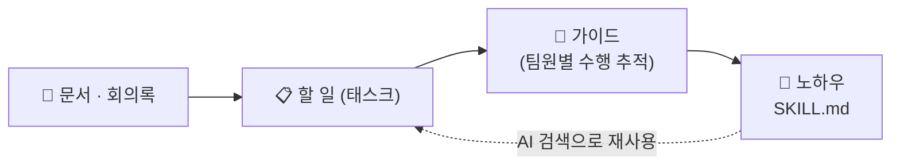
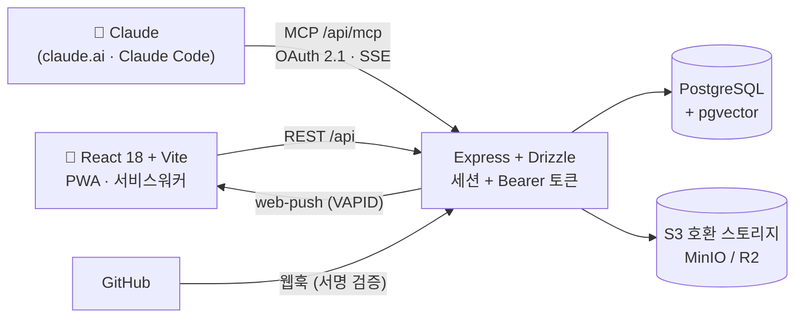

<div align="center">


# DevFlow

**팀의 하루를 정리하고, 그 경험을 팀의 노하우로 남기는 프로젝트 워크스페이스**

[](https://devfloww.replit.app)


[주요 기능](#-주요-기능) · [Claude 연동](#-claude-연동-mcp) · [바로 실행](#-바로-실행해보기) · [아키텍처](#-아키텍처) · [변경 이력](CHANGELOG.md)

</div>

---

## 어떤 도구인가요?

할 일 관리 도구는 많지만, **일이 끝나면 그 과정에서 얻은 노하우도 같이 증발합니다.**
DevFlow는 그 흐름을 하나로 잇습니다 — 설계 문서를 넣으면 **할 일로 분해**되고, 일하는 동안 오간 조언은 **가이드로 추적**되며, 프로젝트가 끝나면 그것들이 **재사용 가능한 노하우 문서(SKILL.md)**로 정리됩니다.


```mermaid
graph LR
  A["📄 문서 · 회의록"] --> B["📋 할 일 (태스크)"]
  B --> C["💬 가이드<br/>(팀원별 수행 추적)"]
  C --> D["🧠 노하우<br/>SKILL.md"]
  D -.->|"AI 검색으로 재사용"| B
```

모바일 퍼스트 PWA이고, **Claude가 MCP로 실제 데이터를 다룰 수 있다**는 점이 가장 큰 특징입니다.

**바로 보시려면** → [devfloww.replit.app](https://devfloww.replit.app) (가입은 누구나, 프로젝트 참여는 초대 링크로만)

## ✨ 주요 기능

| | 기능 | 설명 |
|:--:|------|------|
| 📋 | **할 일 관리** | 복수 담당·체크리스트·서브태스크 롤업 — **리스트 / 칸반 / 캘린더 / 타임라인** 4개 뷰 |
| 🗓 | **팀 워크로드 캘린더** | `행=요일 × 열=팀원` 그리드에서 **카드를 끌어** 날짜·담당자 변경. 일정 리마인더 포함 |
| 📄 | **문서 → 실행 계획** | 설계서를 쓰면 **태스크+체크리스트로 자동 분해**(검토 후 반영, 출처 역추적·진행률) |
| 💬 | **가이드 추적** | 할 일에 남긴 조언을 **팀원별 수행 여부**로 추적 |
| 🧠 | **노하우 추출** | 프로젝트 완료 시 적용된 가이드·해결한 블로커를 모아 **SKILL.md 초안** 생성 → 검수 후 게시 |
| 🎫 | **티켓 워크플로** | 멤버가 작업을 제안 → 매니저가 승인(담당자 배정)/반려(사유 필수) |
| 🤖 | **Claude 연동** | MCP 도구 22종 — 등록·수정·일괄 처리·분해·배정·보고를 **대화로** ([자세히](#-claude-연동-mcp)) |
| 📱 | **설치형 PWA** | 홈 화면 설치, 앱 아이콘 **배지 = 오늘 내 할 일 수**, 웹 푸시 알림 |
| 📝 | **회의록 → 실행항목** | 회의 텍스트에서 결정·실행항목·가이드를 **추출 제안**(사람이 승인해야 반영) |
| 📔 | **내 기록** | 하루 한 장 개인 저널 — **완전 비공개**(관리자도 열람 불가), 이미지 OCR·검색 |
| 🔗 | **GitHub 연동** | 웹훅 서명 검증, 커밋·PR의 `PRJ-12` 키 파싱, PR 머지 시 자동 완료 |
| 🗄 | **프로젝트 정리** | 끝난 프로젝트는 **보관**하거나 **휴지통(30일)**으로 — 무엇이 사라지는지 먼저 보여주고, **노하우는 남긴다** |

## 🤖 Claude 연동 (MCP)

Claude가 DevFlow의 **실제 데이터**로 일합니다 — 태스크 조회·생성·수정·일괄 등록(WBS 계층 포함), 상태 변경, 담당자 배정, 프로젝트 기간 설정, 문서 등록·분해, 일정 관리, 가이드 작성, 지식 검색까지 **도구 22종**.

**이런 걸 시킬 수 있어요**

> 💬 "이 설계 문서를 devflow에 등록하고, 태스크로 분해해서 팀원들에게 배정해줘"
> 💬 "이번 주 이유빈 할 일 정리해서 보고해줘. 빠진 것 같은 작업 있으면 제안도."
> 💬 "PRJ-12 체크리스트 진행 상황 확인하고 막힌 부분에 가이드 남겨줘"

**연결 방법**

<table>
<tr><td width="50%" valign="top">

**① claude.ai · 데스크톱** _(권장 — 토큰 불필요)_

설정 → 커넥터 → **커스텀 커넥터 추가**

```
https://devfloww.replit.app/api/mcp
```

브라우저에서 로그인·동의만 하면 끝
<sub>OAuth 2.1 · PKCE · 동적 클라이언트 등록</sub>

</td><td width="50%" valign="top">

**② Claude Code** _(개인 토큰)_

설정 → MCP 연동·토큰 탭에서 발급 후

```bash
claude mcp add --transport http devflow \
  https://devfloww.replit.app/api/mcp \
  --header "Authorization: Bearer <토큰>"
```

</td></tr>
</table>

## 🚀 바로 실행해보기

DB도 Docker도 없이, **명령 두 줄로** 데모 데이터(10명 팀·30개 태스크)가 채워진 앱이 뜹니다.

```bash
npm install
npm run dev:ui      # → http://localhost:5173  ·  로그인: owner@devflow.local / password123
```

<sub>인메모리 DB(PGlite)로 도는 미리보기라 재시작하면 초기화됩니다. 실행되는 코드는 배포본과 동일합니다.</sub>

<details>
<summary><b>실제 DB로 개발하기 (Docker · 로컬)</b></summary>

### Docker — 로컬이 프로덕션 복제본

```bash
cp .env.example .env        # ★ 필수 — compose가 시크릿을 .env에서 읽습니다 (실값은 커밋 금지)
docker compose up --build   # app + Postgres/pgvector + MinIO(+버킷 생성)
# → http://localhost:5000
```

`app` 컨테이너는 기동 시 `db:push`(멱등 마이그레이션)를 먼저 실행합니다.

### 로컬 개발

```bash
npm install
cp .env.example .env
npm run db:push     # 스키마 적용 (재실행 가능)
npm run db:seed     # (선택) 데모 데이터 — 로컬 전용, 프로덕션 실행 금지
npm run dev         # server(5000) + vite(5173, 0.0.0.0 바인딩)
```

</details>

<details>
<summary><b>배포하기 (Replit 등) — 첫 설치 체크리스트</b></summary>

**필수 Secrets**: `DATABASE_URL` `SESSION_SECRET` `INVITE_TOKEN_SECRET` `API_TOKEN_SECRET` `FIELD_ENCRYPTION_KEY` `APP_BASE_URL`(배포 도메인)
**선택**: `GITHUB_WEBHOOK_SECRET`, `VAPID_PUBLIC_KEY`/`VAPID_PRIVATE_KEY`/`VAPID_SUBJECT`(푸시), LLM 키(관리자 UI에서도 입력 가능)

새 환경에 올릴 때 위에서 아래 순서대로:

1. **시크릿 4종 발급** — `SESSION_SECRET` `INVITE_TOKEN_SECRET` `API_TOKEN_SECRET` `FIELD_ENCRYPTION_KEY`를 각각 `openssl rand -hex 32`로 생성 (프로덕션에서 기본값이면 **부팅 거부**)
2. **DB 마이그레이션** — `npm run db:push` 1회. **자동 실행되지 않습니다**(Docker compose만 자동) — session 테이블이 없으면 로그인 자체가 실패
3. **⚠️ 최초 관리자 생성 — 배포 직후 바로** — 로그인 화면 **"최초 설정" 탭**에서 첫 계정 생성. **첫 계정 = 사이트 관리자**이며 유저가 0명일 때만 열립니다. 방치하면 아무나 먼저 가입해 관리자를 선점할 수 있어요
4. (선택) **푸시 알림** — `npx web-push generate-vapid-keys`로 키쌍 생성 후 등록. 키가 없으면 발송만 조용히 꺼집니다. 운영 중 교체하면 기존 기기 구독이 무효화됩니다
5. (선택) **AI 기능** — 관리자로 `/admin`에서 LLM 프로바이더·키 입력(암호화 저장, 재시작 불필요). env(`LLM_*`)로도 가능
6. (선택) **GitHub 연동** — ① `GITHUB_WEBHOOK_SECRET` 설정 + 저장소 Webhooks에 `{APP_BASE_URL}/api/webhooks/github` (JSON, push·pull_request) 등록 → ② `PATCH /api/projects/:id`로 `{"github_repo": "owner/repo"}` 바인딩 (아직 UI 없음)

> ⚠️ `npm run db:seed`는 **로컬·데모 전용**입니다 — 고정 비밀번호 계정을 만들고, 먼저 돌리면 유저가 생겨 "최초 설정"이 막힙니다.

</details>

<details>
<summary><b>모바일 앱으로 쓰기 (PWA)</b></summary>

| 기능 | 동작 |
|------|------|
| 홈 화면 설치 | manifest + 아이콘 3종 + iOS 메타 — 주소창 없는 앱 모드 실행 |
| 앱 아이콘 배지 | **오늘 내 할 일 수** — 앱 포커스 시 갱신 + 푸시 수신 시 서버가 미완료 수 자동 첨부 |
| 푸시 알림 | 티켓 요청/승인/반려 · 가이드 등록 · 일정 리마인더 (멱등 발송) |
| 켜는 법 | 설치된 앱에서 **설정 → 모바일 앱·알림 → 알림 켜기 → 테스트 알림** |

설치: Android는 Chrome ⋮ → 앱 설치 / iPhone은 Safari 공유 → 홈 화면에 추가 (iOS 16.4+, 설치된 앱에서만 푸시 동작)
아이콘 재생성은 `npx tsx scripts/gen-icons.ts` · 발송에는 VAPID 키 필요

</details>

## 🏗 아키텍처


```mermaid
graph LR
  U["📱 React 18 + Vite<br/>PWA · 서비스워커"] -- "REST /api" --> S["Express + Drizzle<br/>세션 + Bearer 토큰"]
  C["🤖 Claude<br/>(claude.ai · Claude Code)"] -- "MCP /api/mcp<br/>OAuth 2.1 · SSE" --> S
  G["GitHub"] -- "웹훅 (서명 검증)" --> S
  S --> D[("PostgreSQL<br/>+ pgvector")]
  S --> F[("S3 호환 스토리지<br/>MinIO / R2")]
  S -- "web-push (VAPID)" --> U
```

| 레이어 | 스택 |
|--------|------|
| 프론트 | React 18 + TS + Vite, Tailwind, TanStack Query, wouter, react-hook-form (mobile-first) |
| 백엔드 | Express + TS(Drizzle ORM), express-session + connect-pg-simple, bcryptjs(cost 12) |
| DB | PostgreSQL + pgvector (RAG 임베딩 검색) — 테스트는 PGlite 인메모리로 실제 SQL 실행 |
| 파일 | multer + S3 호환 어댑터(로컬=MinIO, 배포=S3/R2/Supabase) + sharp 썸네일 |
| 알림 | web-push(VAPID) + 서비스워커 + node-cron(Asia/Seoul, 멱등) |
| AI | LLM 프로바이더 교체형(mock/openai/anthropic, 관리자 UI에서 키 관리) — 오프라인 시 결정론적 fallback |

<details>
<summary><b>디렉터리 구조</b></summary>

```
shared/schema.ts         Drizzle 스키마 + 타입 (client/server 공용)
migrations/0000_init.sql 멱등 DDL (재실행 가능) + pgvector
server/src/
  app.ts, index.ts       Express 앱/부트스트랩 (0.0.0.0 바인딩)
  middleware/            auth(세션+Bearer 토큰), 보안헤더, 에러핸들러
  routes/                auth, tokens, projects(+projectTasks, projectPages), tasks, comments, mywork,
                         attachments, push, skills, dependencies, ai, webhooks, snippets, mcp, oauth,
                         admin, meetings, gallery, events
  lib/                   db(pg/PGlite), crypto, password, storage, fileType, markdown, taskService,
                         llm, embeddings, github, meetingExtract, pageDecompose, adminSettings,
                         skillExtractor, push, oauth
  jobs/                  scheduler(cron), notifications(digest/reminder, 멱등)
client/src/
  pages/                 Login, InviteAccept, MyWork, Projects, ProjectMembers, ProjectBoard, TaskDetail,
                         ProjectPages, Skills, Ai, Preview, Meetings, Gallery, Admin, Settings
  components/            Layout(하단탭바·미니달력·설정), ProjectNav, KanbanBoard, UpdatesPanel,
                         Attachments, TaskCard, MiniCalendar, EventModal/Strip, PageTree/Editor,
                         DecomposeModal, Ticket*, ui(토스트·useConfirm)
  lib/, hooks/           api, queryClient, activeProject, format(날짜 규약), usePush, useAuth
```

</details>

## 🔐 보안

- **인가** — 무인증 GET 금지(멤버십 검사), 서버측 인가, 초대 토큰 전용 합류, PATCH 화이트리스트(매스어사인먼트 차단)
- **인증** — 로그인 열거 방지(일반화 메시지+타이밍 균등화) + rate limit + 계정잠금, bcrypt(12), 쿠키 httpOnly+sameSite=lax(+secure)
- **비밀번호 재설정** — 메일 링크(해시 저장·2시간·1회용), 요청 단계도 열거 방지, 재설정 시 세션·API 토큰 전량 폐기, 링크는 `APP_BASE_URL` 고정(Host 헤더 포이즈닝 차단)
- **역할** — 프로젝트 역할 소유자 > 매니저 > 멤버(소유권 양도로만 이동) ⊥ 사이트 관리자(is_admin) 별개 축
- **업로드** — magic-number 검증(클라 mime 불신) · private 버킷 · 인가 후 다운로드 · attachment 헤더 · HTML/SVG 차단
- **콘텐츠** — 마크다운 sanitize(DOMPurify), 프리뷰 sandbox iframe + CSP(외부 네트워크 차단)
- **토큰·키** — API 토큰 해시 저장(원문 1회 노출), LLM 키 AES-256 암호화, 웹훅 서명 검증+멱등, 시크릿 전부 env
- **감사** — activity_log 전 구간 기록 + 프로젝트 영구 삭제는 별도 표에 스냅샷(activity_log는 프로젝트와 함께 지워지므로)
- **파괴적 작업** — 프로젝트 보관·삭제, 재설정 링크 발급은 **웹 로그인(세션) 전용** — Bearer 토큰으로는 불가

## 🧪 테스트

```bash
npm run check   # tsc 전체 타입체크
npm test        # 통합 테스트 98개 (Node 내장 러너 + PGlite 인메모리 Postgres, 외부 DB 불필요)
```

각 Phase의 happy path + **권한 거부 케이스**까지 포함합니다.

## 🗺 로드맵

- ICS 캘린더 피드(읽기 전용, api_tokens 스코프)
- Obsidian export(스킬 → 위키링크 볼트 + 인덱스 노트), 지식 그래프(GraphRAG)
- 갤러리 정적 드래그드롭 호스팅, 목록 API 페이지네이션, 소프트삭제
- 실제 LLM 키 연결로 AI 기능(의미 검색·분해 보강) 활성화

## 📚 더 보기

| 문서 | 내용 |
|------|------|
| [CHANGELOG.md](CHANGELOG.md) | 기능 변경 이력 · 개발 일지(P0~P10, 후속 배치) |
| [HANDOFF.md](HANDOFF.md) | 환경 제약 + 세션별 작업 기록 |
| [devflow-build-prompt.md](devflow-build-prompt.md) | 빌드 스펙 원천 |
| [CLAUDE.md](CLAUDE.md) | 코드 규약 · 작업 워크플로 (기여 시 필독) |
